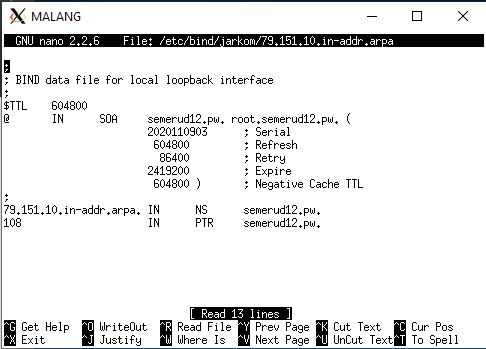
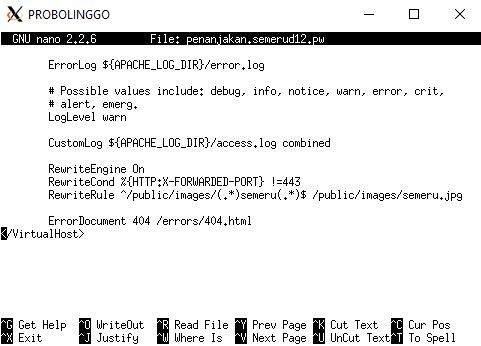
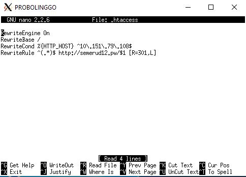

# Jarkom_Modul2_Lapres_D12
- Muhammad Ilham Bayhaqi - 05111840000069
- Clever Dicki Marpaung - 05111840000116

# Solusi

### Soal 1
- Pada UML Malang dilakukan konfigurasi zone pada /etc/bind/named.conf.local sebagai berikut.   
</img>
- Melakukan copy pada file /etc/bind/db.local ke /etc/bind/jarkom/semerud12.pw   
- Pada /etc/bind/jarkom/semerud12.pw dilakukan konfigurasi dengan record A mengarah ke IP Malang sebagai berikut.   
</img>
- Melakukan restart bind9 dengan ```service bind9 restart``` dan pada client ditambahkan nameserver IP Malang.   

### Soal 2
- Pada UML Malang, dilakukan konfigurasi pada file /etc/bind/jarkom/semerud12.pw ditambahkan record CNAME sebagai berikut.   
</img>
- Melakukan restart bind9 dengan  ```service bind9 restart```

### Soal 3
- Pada UML Malang, dilakukan konfigurasi pada file /etc/bind/jarkom/semerud12.pw ditambahkan record untuk subdomain sebagai berikut.      
</img>
- Melakukan restart bind9 dengan  ```service bind9 restart```

### Soal 4
- Pada UML Malang dilakukan konfigurasi zone untuk Reverse DNS pada /etc/bind/named.conf.local sebagai berikut.   
</img>
- Melakukan copy pada file /etc/bind/db.local ke /etc/bind/jarkom/79.151.10.in-addr.arpa
- Pada /etc/bind/jarkom/79.151.10.in-addr.arpa dilakukan konfigurasi untuk Reverse DNS nya menuju semerud12.pw.   
</img> 
- Melakukan restart bind9 dengan ```service bind9 restart``` dan pada client ditambahkan nameserver IP Malang.

### Soal 5
- Pada UML Malang dilakukan konfigurasi zone  pada /etc/bind/named.conf.local untuk dijadikan master sebagai berikut.   
</img>
- Dilakukan restart bind9 dengan ```service bind9 restart``` pada UML Malang.
- Pada UML Mojokerto dilakukan konfigurasi pada /etc/bind/named.conf.local untuk dijadikan slave sebagai berikut.   
</img>
- Dilakukan restart bind9 dengan ```service bind9 restart``` pada UML Mojokerto.   
- Untuk testing dilakukan ```service bind9 stop``` pada UML Malang.

### Soal 6
- Pada UML Malang dilakukan konfigurasi pada /etc/bind/jarkom/semerud12.pw untuk melakukan delegasi name server pada IP Mojokerto.   
</img>
- Pada file /etc/bind/named.conf.options di UML Malang dilakukan comment untuk **dnssec-validation auto;** dan ditambahkan **allow-query{any;};**
- Pada file /etc/bind/named.conf.local di UML Malang dibuat konfigurasi seperti ini
</img>
- Pada file /etc/bind/named.conf.options di UML Mojokerto dilakukan comment untuk **dnssec-validation auto;** dan ditambahkan **allow-query{any;};**
- Pada file /etc/bind/named.conf.local di UML Mojokerto dibuat konfigurasi seperti ini   
</img>
- Kemudian, melakukan konfigurasi untuk file /etc/bind/delegasi/gunung.semerud12.pw sebagai berikut.   
</img>
- Dilakukan ```service bind9 restart``` pada UML Malang dan Mojokerto.

### Soal 7
- Pada file nano /etc/bind/delegasi/gunung.semerud12.pw ditambahkan record untuk subdomain naik sebagai berikut.   
</img>

### Soal 8
- Pertama, melakukan instalasi apache2 dan php5 pada server Probolinggo.
- Kemudian dilakukam download file dengan perintah wget 10.151.36.202/semeru.pw.zip dan hasil unzip semeru.pw dan di pindahkan menuju /var/www/semerud12.pw. 
- Untuk konfigurasinya maka dibuatkan file semerud12.pw pada direktori /etc/apache2/sites-available/semerud12.pw yang awalnya merupakan file copy dari file default.
- Isi konfigurasinya sebagai berikut.   
</img>
- Untuk mengaktifkan sitenya maka dilakukan perintah a2ensite semerud12.pw dan dilakukan restart pada Apache2.   
</img>

### Soal 9
- Untuk melakukan mod rewrite maka mod rewrite perlu diaktifkan dengan menggunakan command **a2enmod rewrite**
- File konfigurasi mod rewrite diletakkan di /var/www/semerud12.pw/.htaccess berisi konfigurasi sebagai berikut.   
</img>

### Soal 10
- Pertama, melakukan download file untuk penanjakan dengan perintah wget 10.151.36.202/penanjakan.semeru.pw.zip dan hasil unzipnya dipindakhan menuju /var/www/penanjakan.semerud12.pw.
- Untuk konfigurasinya dibuatkan file penanjakan.semerud12 pada direktori /etc/apache2/sites-available/penanjakan.semerud12.pw yang awalnya merupakan file copy dari file default.
- Untuk Konfigurasinya sebagai berikut.   
</img>
- Untuk mengaktifkan sitenya maka dilakukan perintah a2ensite semerud12.pw dan dilakukan restart pada Apache2.

### Soal 11
- Karena pada folder /public dibolehkan directory listing  dan di dalamnya tidak maka dibuatkan konfigurasi sebagai berikut.   
</img>   
</img>   
- Agar konfigurasinya dijalankan maka dilakukan restart Apache2.
- Ketika mencoba mengakses public maka seperti berikut.   
</img>
- Ketika mencoba mengakses images maka keluar sebagai berikut.   
</img>

### Soal 12
- Pada folder /errors disediakan page 404. Untuk mengubah page 404 default pada penanjakan.semerud12.pw, maka ditambahkan sebuah konfigurasi pada /etc/apache2/sites-available/penanjakan.semerud12.pw.
- Konfigurasinya ditambahkan ErrorDocumet 404 sebagai berikut.   
</img>
- Agar konfigurasinya dijalankan maka dilakukan restart Apache2.   
</img>

### Soal 13
- Pada konfigurasi /etc/apache2/sites-available/penanjakan.semerud12.pw ditambahkan alias sebagai berikut.   
</img>
- Agar konfigurasinya dijalankan maka dilakukan restart Apache2.   
</img>

### Soal 14
- Pertama, melakukan download file untuk penanjakan dengan perintah wget 10.151.36.202/naik.gunung.semeru.pw.zip dan hasil unzipnya dipindakhan menuju /var/www/naik.gunung.semerud12.pw.
- Untuk konfigurasinya dibuatkan file penanjakan.semerud12 pada direktori /etc/apache2/sites-available/naik.gunung.semerud12.pw yang awalnya merupakan file copy dari file default.
- Agar hanya bisa diakses menggunakan port 8888 maka pada Virtual Host di set untuk port 8888.
- Untuk Konfigurasinya sebagai berikut.   
</img>
- Untuk mengaktifkan sitenya maka dilakukan perintah a2ensite semerud12.pw dan dilakukan restart pada Apache2.

### Soal 15
- Pada Apache2-Utils terdapat fitur yang dapat digunakan untuk membuat user dengan htpasswd. Untuk membuat akun dengan nama "semeru", maka dilakukan dengan command sebagai berikut.
```
 htpasswd -c /etc/apache2/.htpasswd semeru
```
- Setelah dilakukan command tersebut, nanti akan ada perintah untuk meninputkan password. Password disi dengan "kuynaikgunung".
- Bila user berhasil dibuat maka pada file /etc/apache2/.htpasswd akan terlihat sebagai berikut.   
</img>
- Agar Authentikasi diterapkan Auth(pada kasus ini digunakan Auth Basic) maka ditambahkan konfigurasi pada file /etc/apache2/sites-available/naik.gunung.semerud12.pw sebagai berikut.   
</img>
- Agar konfigurasinya dijalankan maka dilakukan restart Apache2.
</img>

### Soal 16
- Agar bila IP Probolinggo ketika dikunjungi mengarah ke semeru, maka pada /etc/apache2/sites-available/default dibuat AllowOveride All sebagai berikut.   
</img>
- Kemudian pada /var/www/.htaccess ditambahkan mod rewrite sebagai berikut.   
</img>
- Agar konfigurasinya dijalankan maka dilakukan restart Apache2.   

### Soal 17
- Pada Soal ini dilakukan konfigurasi pada /etc/apache2/sites-available/penanjakan.semerud12.pw sebagai berikut.
</img>
- Agar konfigurasinya dijalankan maka dilakukan restart Apache2.
- Bila dicoba menggunakan penanjakan.semerud12.pw/public/images/mahasemeru maka akan menampilkan gambar semeru.jpg seperti berikut.
</img>


